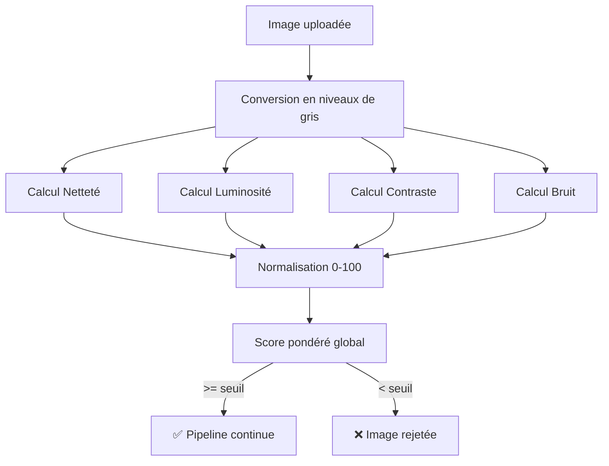
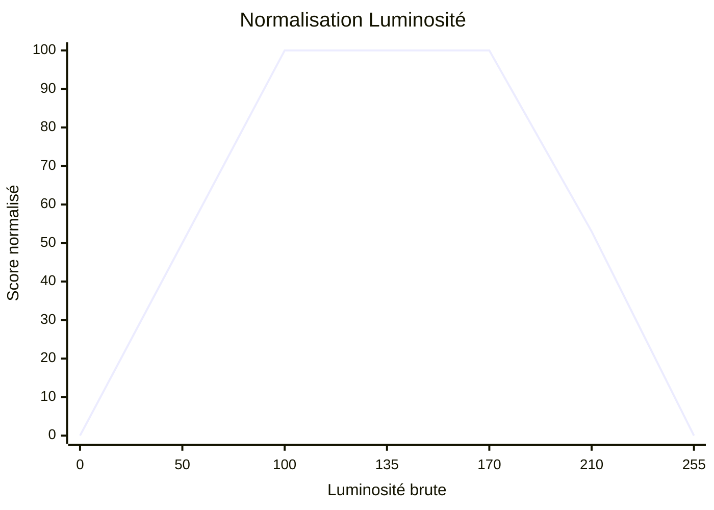
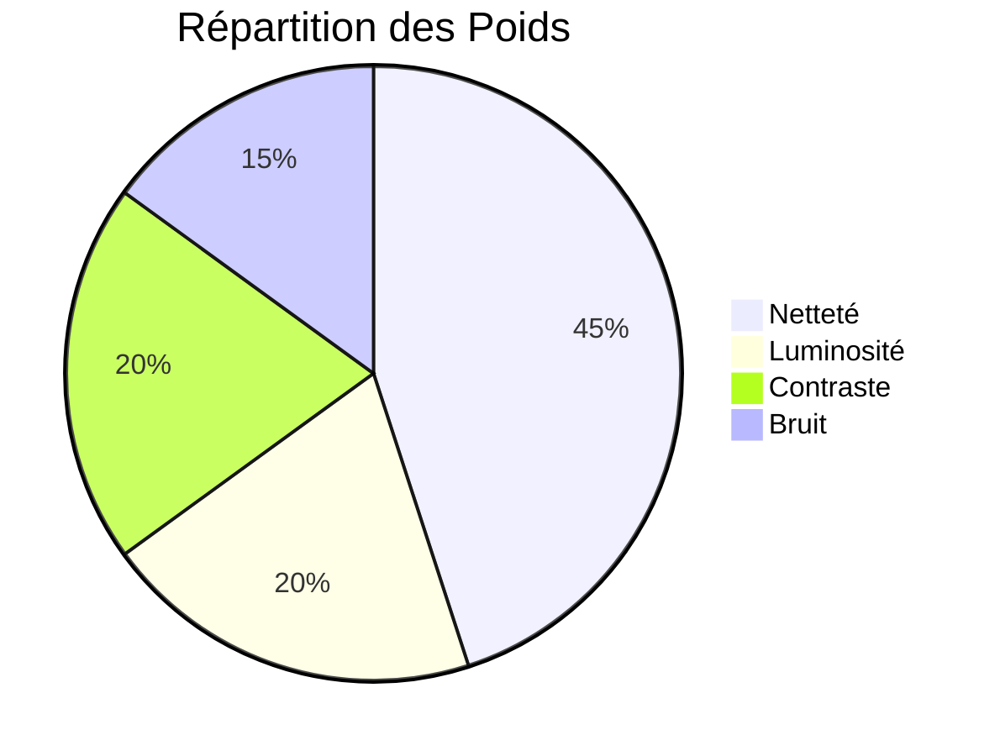

# Quality Service — Explication Détaillée des Métriques

## Vue d'ensemble

Le Quality Service agit comme un **gardien** (gate keeper) dans le pipeline. Avant de dépenser des ressources à prétraiter et transcrire une image, on vérifie d'abord qu'elle est **exploitable**. Le principe est simple : on calcule 4 métriques, on normalise chacune sur 0-100, on les combine avec des poids, et on compare le score final à un seuil.



---

## 1. Netteté (Sharpness) — Poids : 45%

> [!IMPORTANT]
> C'est la métrique la plus critique. Une image floue rend la reconnaissance d'écriture quasiment impossible, même avec un excellent modèle.

### Principe : la Variance du Laplacien

L'idée est qu'une image **nette** contient beaucoup de **transitions brusques** (des bords nets entre l'encre et le papier), alors qu'une image **floue** a des transitions douces et graduelles.

Le **Laplacien** est un opérateur mathématique qui détecte ces transitions. C'est un noyau de convolution 3×3 :

```
     [ 0,  1,  0]
L =  [ 1, -4,  1]
     [ 0,  1,  0]
```

### Comment ça fonctionne concrètement

Pour chaque pixel de l'image (sauf les bords), on fait ce calcul :

```
Laplacien(x,y) = pixel_haut + pixel_bas + pixel_gauche + pixel_droite - 4 × pixel_central
```

````carousel
**Cas d'une image nette :**

Imaginons une zone avec un bord net d'encre (noir = 0, blanc = 255) :

```
     255  255  255
     255    0    0
     255    0    0
```

Laplacien du pixel central :
`255 + 0 + 255 + 0 - 4×0 = 510` → **grande valeur**

Le Laplacien réagit fortement aux transitions brusques.
<!-- slide -->
**Cas d'une image floue :**

La même zone mais floue (les transitions sont graduelles) :

```
     255  230  200
     230  180  150
     200  150  120
```

Laplacien du pixel central :
`230 + 150 + 230 + 150 - 4×180 = 40` → **petite valeur**

Le Laplacien réagit faiblement aux transitions douces.
````

On calcule ensuite la **variance** (dispersion statistique) de tous ces Laplaciens :
- **Variance élevée** → beaucoup de contours nets → image nette
- **Variance faible** → peu de contours → image floue

### Code simplifié

```python
# 1. Convertir en niveaux de gris
gray = image en niveaux de gris (matrice de pixels 0-255)

# 2. Appliquer le Laplacien sur chaque pixel intérieur
laplacian = (pixel_haut + pixel_bas + pixel_gauche + pixel_droite) - 4 × pixel_central

# 3. Calculer la variance
score_netteté = variance(laplacian)
```

### Échelle de valeurs brutes

| Valeur brute | Interprétation |
|:---:|---|
| < 50 | Très floue — illisible |
| 50 – 200 | Acceptable — déchiffrable |
| > 200 | Nette — idéale pour HTR |

### Normalisation

La valeur brute est mappée linéairement vers 0-100, avec 500 comme valeur « parfaite » :

```
score_normalisé = min(100, (valeur_brute / 500) × 100)
```

Exemples : `100 → 20/100`, `250 → 50/100`, `500+ → 100/100`

---

## 2. Luminosité (Brightness) — Poids : 20%

### Principe : la Moyenne des Pixels

On convertit l'image en niveaux de gris (canal L pour Luminance), puis on calcule simplement la **moyenne** de tous les pixels.

```python
gray = image convertie en niveaux de gris
luminosité = moyenne(tous les pixels)  # résultat entre 0 et 255
```

- **0** = noir total (aucune lumière)
- **127** = gris moyen
- **255** = blanc total (surexposé)

### Pourquoi c'est important

````carousel
**Image trop sombre (luminosité < 60)**

L'encre se confond avec le fond sombre.
Le modèle ne distingue plus le texte du papier.

```
Exemple : photo prise dans une pièce mal éclairée
Luminosité brute ≈ 40 → Score : 40/100
```
<!-- slide -->
**Image bien éclairée (luminosité 100-170)**

L'encre noire contraste bien avec le fond clair.
Zone idéale pour la reconnaissance.

```
Exemple : scan ou photo avec bon éclairage
Luminosité brute ≈ 140 → Score : 100/100
```
<!-- slide -->
**Image surexposée (luminosité > 200)**

Le fond est tellement blanc que l'encre pâle disparaît.
Les traits fins deviennent invisibles.

```
Exemple : flash trop puissant, scan surexposé
Luminosité brute ≈ 230 → Score : 29/100
```
````

### Normalisation

La normalisation n'est **pas linéaire** — elle utilise une courbe en « plateau » :

```
Si 100 ≤ luminosité ≤ 170 → score = 100  (zone idéale)
Si luminosité < 100        → score = (luminosité / 100) × 100
Si luminosité > 170        → score = (1 - (luminosité - 170) / 85) × 100
```



---

## 3. Contraste (Contrast) — Poids : 20%

### Principe : l'Écart-type de la Luminance

Le contraste mesure **la dispersion** des valeurs de pixels. Une image à fort contraste a des pixels très sombres ET des pixels très clairs. Une image à faible contraste est uniformément grise.

```python
gray = image convertie en niveaux de gris
contraste = écart_type(tous les pixels)
```

### Intuition

````carousel
**Faible contraste (écart-type < 30)**

Tous les pixels sont proches de la même valeur.
L'encre et le fond ont des teintes similaires.

```
Pixels : [120, 125, 118, 130, 122, ...]
Écart-type ≈ 5 → Score : 6/100
```

C'est comme essayer de lire du texte gris sur fond gris.
<!-- slide -->
**Bon contraste (écart-type 30–80)**

Les pixels sont bien répartis entre clair et foncé.
L'encre noire se détache clairement du fond blanc.

```
Pixels : [10, 240, 15, 235, 20, 230, ...]
Écart-type ≈ 60 → Score : 75/100
```

Idéal pour que le modèle distingue les caractères.
````

### Normalisation

```
score_normalisé = min(100, (écart_type / 80) × 100)
```

Exemples : `20 → 25/100`, `40 → 50/100`, `80+ → 100/100`

---

## 4. Bruit (Noise) — Poids : 15%

### Principe : MAD (Median Absolute Deviation)

Le bruit, ce sont les **petites variations parasites** dans l'image — des pixels qui n'ont rien à voir avec le texte. C'est souvent causé par un mauvais capteur photo, une compression agressive, ou une mauvaise numérisation.

La méthode utilisée est robuste et classique en traitement d'image :

```python
# 1. Appliquer le Laplacien (même noyau que pour la netteté)
laplacian = convolution de l'image avec le noyau Laplacien

# 2. Prendre les valeurs absolues
abs_laplacian = |laplacian|

# 3. Calculer la médiane (pas la moyenne — plus robuste)
median = médiane(abs_laplacian)

# 4. Estimer sigma (le niveau de bruit)
sigma = median / 0.6745
```

> [!NOTE]
> Le facteur **0.6745** vient de la statistique : pour une distribution gaussienne, `MAD / 0.6745` est un estimateur robuste de l'écart-type. C'est la constante qui relie la médiane des déviations absolues à l'écart-type σ.

### Pourquoi MAD plutôt que la variance ?

La **variance** serait polluée par le texte lui-même (qui crée de « vraies » transitions). Le **MAD** est robuste aux outliers : le texte, qui représente une fraction des pixels, n'influence pas la médiane.

### Normalisation (inversée)

Attention : **moins il y a de bruit, mieux c'est** → le score est inversé :

```
score_normalisé = max(0, (1 - sigma / 20) × 100)
```

| Sigma brut | Score | Interprétation |
|:---:|:---:|---|
| 0 – 2 | 90 – 100 | Très propre |
| 5 – 10 | 50 – 75 | Bruit modéré |
| 15 – 20 | 0 – 25 | Très bruité |

---

## Score Global : la Combinaison Pondérée

Les 4 scores normalisés sont combinés avec des **poids** qui reflètent leur importance pour le HTR :

```python
score_global = (
    netteté_normalisée  × 0.45 +   # 45% — critique
    luminosité_normalisée × 0.20 +   # 20%
    contraste_normalisé  × 0.20 +   # 20%
    bruit_normalisé      × 0.15     # 15%
)
```



> [!TIP]
> La netteté domine volontairement car même une image sombre ou peu contrastée peut être améliorée par le prétraitement (rehaussement de contraste, ajustement de luminosité), mais une image **floue est irrécupérable** — aucun algorithme ne peut inventer des détails qui n'existent pas.

---

## Exemple concret : `4.jpeg`

```
Score global : 55.4 / 100  →  ✅ ACCEPTÉE (seuil: 50)

🔍 Netteté    : 32.9/100  🔴  (brut: 164.49)  ← point faible
☀️ Luminosité : 97.8/100  🟢  (brut: 171.87)  ← excellent
🎛️ Contraste  : 35.6/100  🟢  (brut: 28.47)   ← passable
📡 Bruit      : 92.6/100  🟢  (brut: 1.48)    ← très propre
```

**Décomposition :**
```
55.4 = 32.9 × 0.45  +  97.8 × 0.20  +  35.6 × 0.20  +  92.6 × 0.15
     = 14.8         +  19.6         +  7.1          +  13.9
```

L'image passe de justesse grâce à sa bonne luminosité et son faible bruit, malgré une netteté insuffisante. Si le seuil était à 60, elle serait rejetée.
